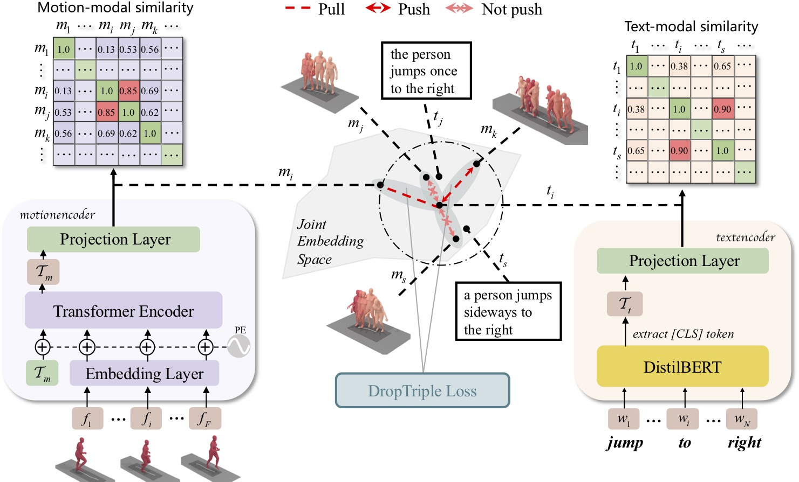

<div align="center">

# Cross-Modal Retrieval for Motion and Text via DropTriple Loss

</div>

## Updates
- 2024/04/24: Added Cross-perceptual Salience Mapping, allowing for the salient
perception of different postures or words based on different
samples.
- 2024/04/24: Unified the training strategies of the two datasets and updated pre-trained models

## Description
Official PyTorch implementation of paper [**"Cross-Modal Retrieval for Motion and Text via DropTriple Loss"**](https://arxiv.org/abs/2305.04195) (ACM Multimedia Asia (MMAsia) 2023) and [**"Improving Fine-grained Understanding for Retrieval in Human Motion and Text"**]() (Under Review).



## Installation

### Create conda environment

Anaconda is recommended to create this virtual environment.
```bash
conda create python=3.9 --name rehamot
conda activate rehamot
```

And install the following packages:
```bash
pip install torch torchvision # Go to https://pytorch.org/get-started/previous-versions/ to find your suitable version
pip install transformers
pip install omegaconf
pip install hydra-core
pip install pandas
pip install einops
pip install rich
pip install tensorboard tensorboardX tensorboard_logger
pip install matplotlib
pip install tqdm
pip install PyYAML
```

### Download the datasets

We are using two 3D human motion-language dataset: HumanML3D and KIT-ML. For both datasets, you could find the details as well as download link [[here]](https://github.com/EricGuo5513/HumanML3D).  
Please note that the Humanml3d dataset needs to be processed through that repository, while KIT-ML can be downloaded directly from the [link](https://drive.google.com/drive/folders/1MnixfyGfujSP-4t8w_2QvjtTVpEKr97t?usp=sharing) in its README

Please move the processed or unzip files to the datasets folder under this project, the file directory should look like this:
```bash
./dataset/
./dataset/HumanML3D/
./dataset/KIT-ML/
...
```

### Download text model dependencies

Download distilbert from __Hugging Face__

```bash
cd deps/
git lfs install
git clone https://huggingface.co/distilbert-base-uncased
git clone https://huggingface.co/sentence-transformers/all-mpnet-base-v2
cd ..
```

## Pre-trained Models

### Download models
Download models [here](https://drive.google.com/file/d/12EH9PKnth_L6AMYYwCuB0LDnSx3zwDpR/view?usp=sharing). Unzip and place them under checkpoint directory, which should be like:
```bash
./checkpoints/humanml3d
./checkpoints/kit/
```

### Evaluate pre-trained models
To evaluate Rehamot, you must run:
```bash
python evaluate.py folder=FOLDER
```
The ```FOLDER``` can be replaced with specific experiment, such as ```./checkpoints/humanml3d/rehamot```

### View the pre-training results
We recorded some metrics using tensorboard, which you can view by running the following command:
```bash
tensorboard --logdir=FOLDER
```
The ```FOLDER``` can be replaced with the main experiment, such as ```./checkpoints/humanml3d```

## Training new models

### Run
The command to launch a training experiment is the folowing:
```bash
python train.py [OPTIONS]
# HumanML3D dataset training
python train.py data=human-ml-3d  machine.batch_size=50
# KIT-ML dataset training
python train.py data=kit-ml  machine.batch_size=25
```
You can override anything in the configuration by passing arguments like `foo=value` or `foo.bar=value`. Of course, you can also modify the configuration directly in the configs folder.


### Some optional parameters
#### Datasets
- ``data=human-ml-3d``: Training Rehamot on HumanML3D
- ``data=kit-ml``: Training Rehamot on KIT-ML

#### Threshold
- ``model.threshold_hetero=0.75``: Set the threshold for heteromorphism
- ``model.threshold_homo=0.75``: Set the threshold for homomorphism 

#### Training
- ``machine.device=gpu``: training with CUDA, on an automatically selected GPU (default)
- ``machine.device=cpu``: training on the CPU (not recommended)

If you want to get started with the training model quickly, you can refer to the configuration of the `.hydra/config.yaml` file under the pre-training model provided by us

## Citation
If you find this code to be useful for your research, please consider citing.
```
@article{yan2023cross,
  title={Cross-Modal Retrieval for Motion and Text via DropTriple Loss},
  author={Yan, Sheng and Liu, Yang and Wang, Haoqiang and Du, Xin and Liu, Mengyuan and Liu, Hong},
  journal={arXiv preprint arXiv:2305.04195},
  year={2023}
}
```

## Acknowledgments

This code is standing on the shoulders of giants. We want to thank the following contributors that our code is based on:

[TEMOS](https://github.com/Mathux/TEMOS), [vse++](https://github.com/fartashf/vsepp).

## License

This code is distributed under an [Apache License 2.0](http://www.apache.org/licenses/LICENSE-2.0)
